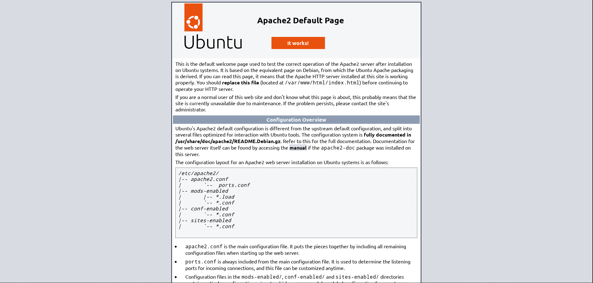

# Apache Server

O intuito deste repo é apresentar minha experiência, realizados durante o deploy de um servidor Apache, configurações feitas, comandos rodados e saídas obtidas.

## Estrutura do projeto
As pastas `etc/apache2/sites-available` e `etc/netplan` são espelhadas no sistema para exemplificar dentro do sistema.

## Configurações do ambiente
- Virtualizador: KVM Virtual Manager (virt-manager)
- VM:
    - 4 Gb RAM
    - 4 Processadores
    - 120 Gi HD
    - Ubuntu Server 22.04.5
    - NAT

## Definindo IP Static
Neste tópico a primeira coisa que fiz, definir um IP estático para facilitar o acesso posteriormente.

### Editar o arquivo netplan

Acessei o seguinte arquivo disponível na minha VM.
> Em seu dispositivo pode ser outro arquivo
``` bash
sudo nano /etc/netplan/50-cloud-init.yaml
```

Editei o arquivo com as seguintes configurações
``` yaml
network:
    version: 2
    renderer: networkd
    ethernets:
        eth0: # ou enp1s0 dependendo da sua VM
            dhcp4: no
            addresses: [10.0.1.10/24]
            routes:
                - to: default
                  via: 10.0.1.1
            nameservers:
                addresses: [8.8.8.8, 8.8.4.4, 1.1.1.1]
```

Apliquei o netplan e reiniciei a VM
``` bash
sudo netplan apply
reboot
```

## Configurando Apache e Certificado
Neste segundo tópico, foi a atividade principal, configuração do apache e disponibilização do site. Possibilitando implementar um sistema através desta VM.

### Instalação do Apache
Fiz a atualização e upgrade dos pacotes para evitar futuros problemas na instalação do Apache
``` bash
sudo apt update && sudo apt upgrade -y
```

Realizar a instalação do Apache
``` bash
# Instalei o arquivo
sudo apt install -y apache2
# Iniciei o serviço
sudo systemctl start apache2
# Verifiquei se o serviço está "running"
sudo systemctl status apache2
```


### Gerando o certificado self-signed
Criei e entrei na pasta para armazenar os meus certificados self-signed
``` bash
mkdir -p ~/apache-server-tls/ssl
cd ~/apache-server-tls/ssl
```

Estou gerando o arquivo dentro da pasta `~/apache-server-tls/ssl/`
``` bash
openssl req -x509 -nodes -days 365 -newkey rsa:2048 \
  -keyout ~/apache-server-tls/ssl/apache-selfsigned.key \
  -out ~/apache-server-tls/ssl/apache-selfsigned.crt \
  -subj "/C=BR/ST=SP/L=SP/O=Hello/CN=10.0.1.10"
```

Fiz uma cópia dos arquivos da minha pasta atual para a `/etc/ssl/certs/`, os quais serão referenciados nos arquivo `apache-tls.conf`
``` bash
sudo cp ~/apache-server-tls/ssl/* /etc/ssl/certs/
```

### Habilitar SSL no Apache
Habilitei os módulos SSL e headers para fazer uso dos certificados
``` bash
sudo a2enmod ssl
sudo a2enmod headers
```

### Configuração do VirtualHost
Criar e editar o arquivo `/etc/apache2/sites-available/apache-tls.conf`
``` bash
sudo vi /etc/apache2/sites-available/apache-tls.conf
```

``` xml
<VirtualHost *:443>
    DocumentRoot /var/www/html

    SSLEngine on
    SSLCertificateFile /etc/ssl/certs/apache-selfsigned.crt
    SSLCertificateKeyFile /etc/ssl/certs/apache-selfsigned.key

    <Directory /var/www/html>
        AllowOverride All
    </Directory>

    ErrorLog ${APACHE_LOG_DIR}/error.log
    CustomLog ${APACHE_LOG_DIR}/access.log combined
</VirtualHost>
```

### Habilitar o site
Habilitei o site para acesso pelo host
``` bash
sudo a2ensite apache-tls.conf
sudo systemctl reload apache2
```

## Testando a aplicação
Não estou utilizando um firewall "ufw", logo fiz o teste apenas acessando o endereço `https://10.0.1.10` e `http://10.0.1.10`, ignorei o aviso de certificado, pois ele é self-signed. Minha página com o Apache estava lá.



## Conclusão
Foi bastante proveitoso o deploy dessa VM e configuração, fornecendo-me uma base de entendimento Linux e configurações básicas em máquinas Linux. Pude reforçar conceitos de Linux e realizar o teste.

Imagino que seja necessário no quesito segurança, realizar as seguintes configurações:
- Criar um usuário com permissões específicas (Mínimo Prilégio) `adduser`
- Habilitar o Firewall `ufw allow 443`
- Fazer o deploy de um sistema